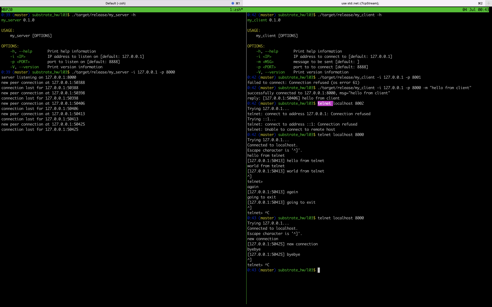

# MyTCP

This is my tcp toy program in Rust.

Two binaries will be generated after running `cargo build --release`, namely `my_server` and `my_client`.

* `my_server` is the main program for the tcp connection response. The listening ip and port can be specified with `-i` and `-p` respectively. It can repond with tcp clients such as `my_client` for `telnet`.
* `my_client` is the sample client for the connection.

# Screenshot

Below is the screenshot. The left side shows `my_server`'s output, based on `my_client` and `telnet` connections, whose output are shown on the right.

