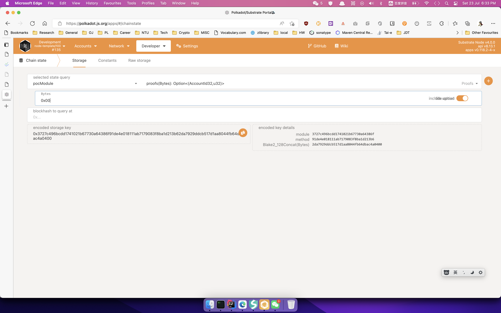
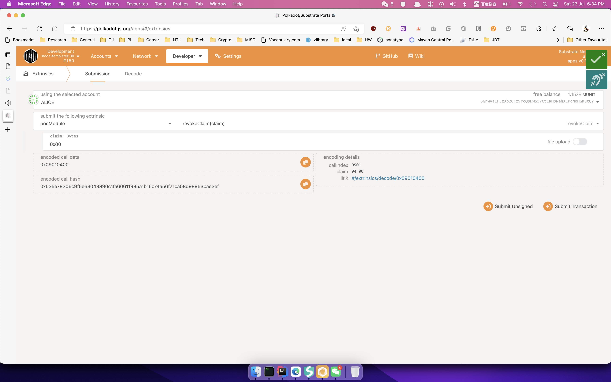
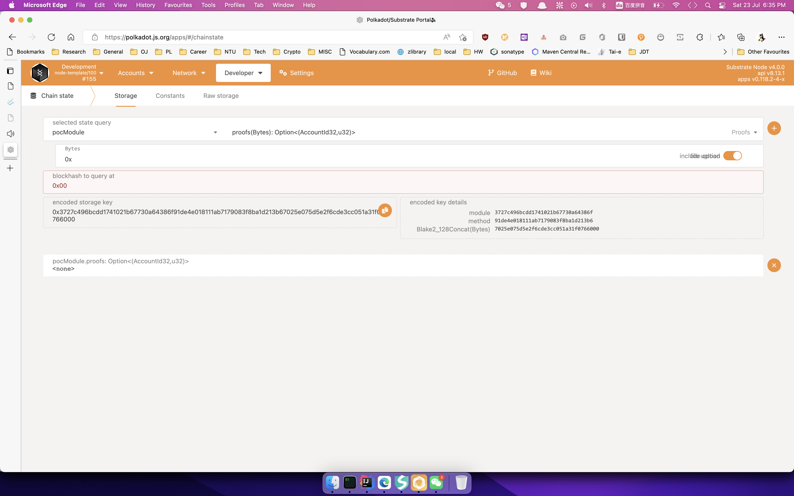

## 基础知识:

### substrate常用宏:
* pallet::call
* pallet::storage
* pallet::event

### storage数据结构:
* StorageValue
* StorageMap
* StorageDoubleMap

## 创建存证和撤销存证
代码参见[这个commit](https://github.com/HongxuChen/substrate-node-template/commit/dcaf01f48e0e3b0c7ad6145cb7cda1217a049d9b)，相关截图如下。

* 创建存证

* 创建存证后状态

* 撤销存证

* 撤销存证后状态

